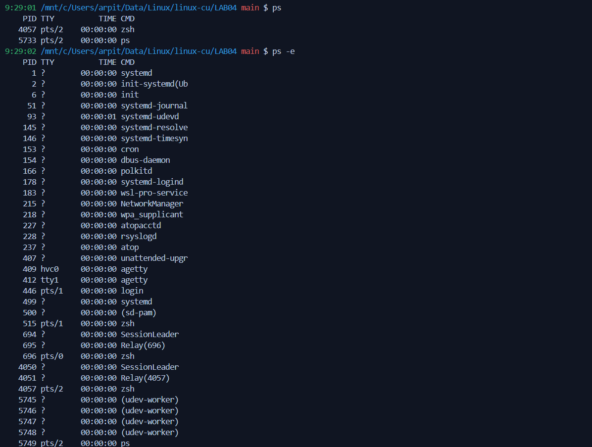
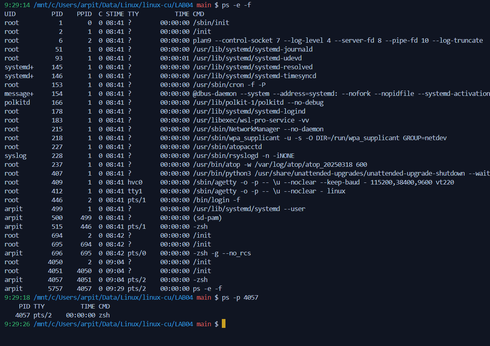
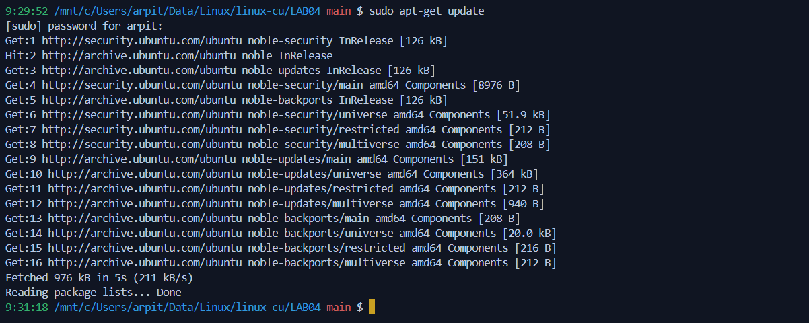
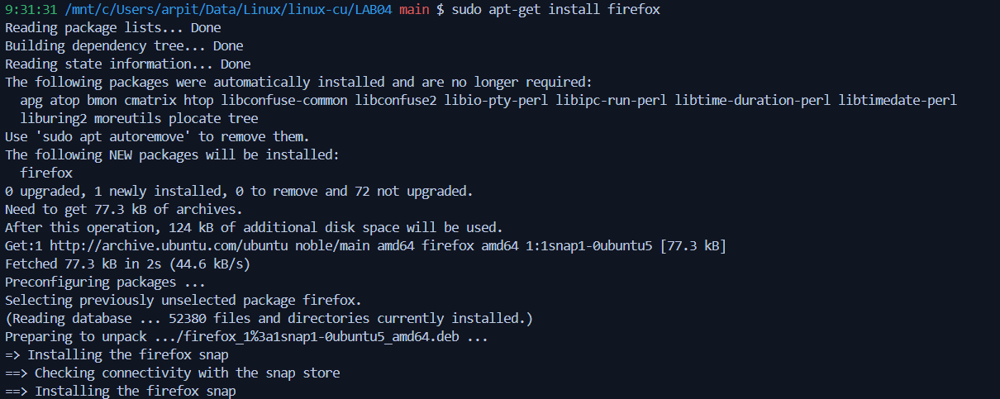
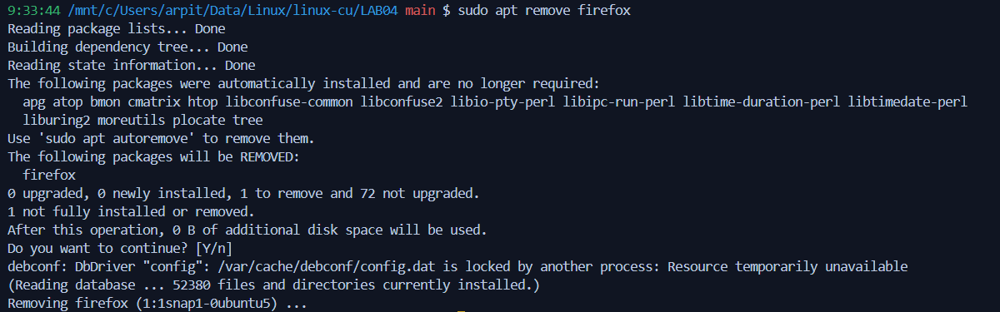

# Lab Experiment 05

**Process Management:**
- Implement ps, top, kill command with their options.

```sh
ps
ps -e
ps -e -f
ps -p 4057
```



**Package Management:**
Installing, updating, and removing software by apt-get command

```sh
sudo apt-get update
sudo apt-get install firefox
sudo apt-get remove firefox
sudo apt-get install firefox
sudo apt-get purge firefox
```





