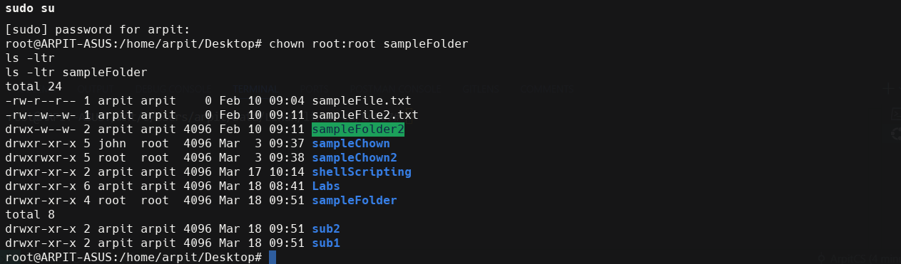
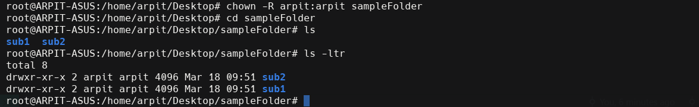
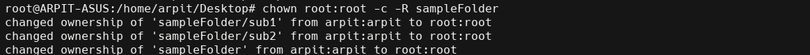
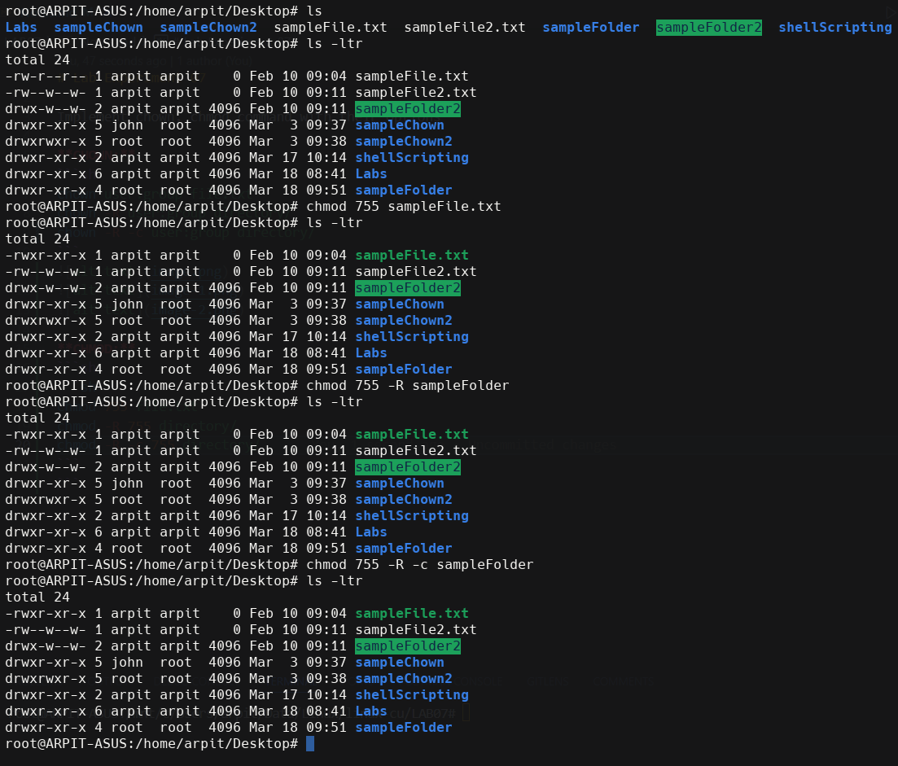

# Lab Experiment 07

Implement chown, chmod command with their options

**CHOWN:**
```sh
chown user:group file.txt
chown -R user:group directory/
chown -R -c user:group directory/
```




**CHMOD:**
```sh
chmod 755 file.txt
chmod -R 755 directory/
chmod -R -c 755 directory/
```

