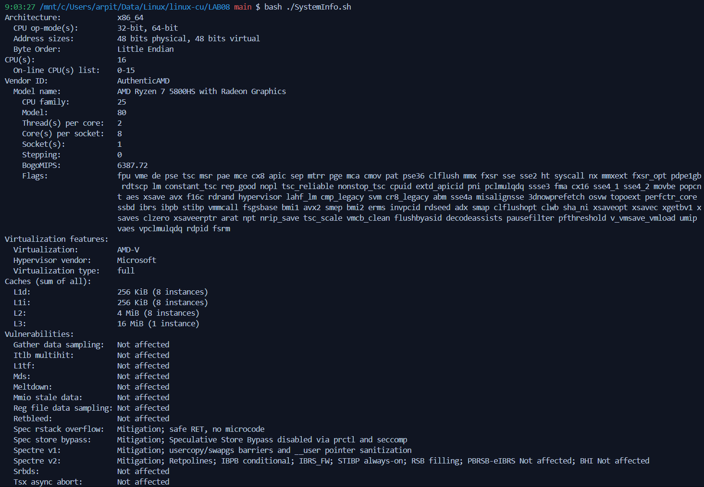
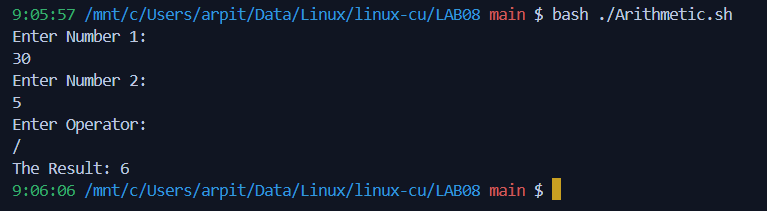
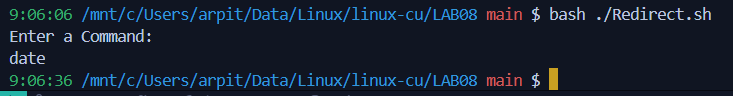
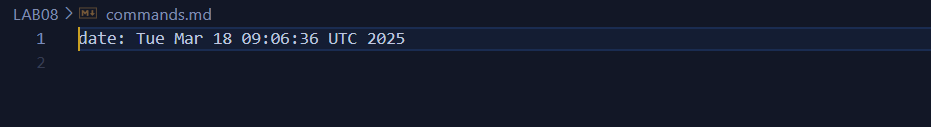

# Lab Experiment 08

**System Infomation Script:**
Write shell scripts to print system information.

```sh
#!/bin/bash
lscpu
```



**Arithmetic Calculation:**
Write shell script to perform basic mathematical calculation.

```sh
#!/bin/bash

echo "Enter Number 1: "
read a

echo "Enter Number 2: "
read b

echo "Enter Operator: "
read op


case $op in 
	+) 
		result=$((a + b))
   	 	;;
	-) 
		result=$((a - b))
    		;;
	x) 
		result=$((a * b))
    		;;
	/) 
		result=$((a / b))
    		;;
	%)
    		result=$((a % b))
    		;;
	*)
		echo "Invalid Operator" 
		exit 1
    		;;
esac 

echo "The Result: $result"
```



**Redirect Output:**
Use redirection operators to store the output of commands.

```sh
#!/bin/bash

echo "Enter a Command: "
read command

output=$($command)

echo "$command: $output" >> commands.md
```



